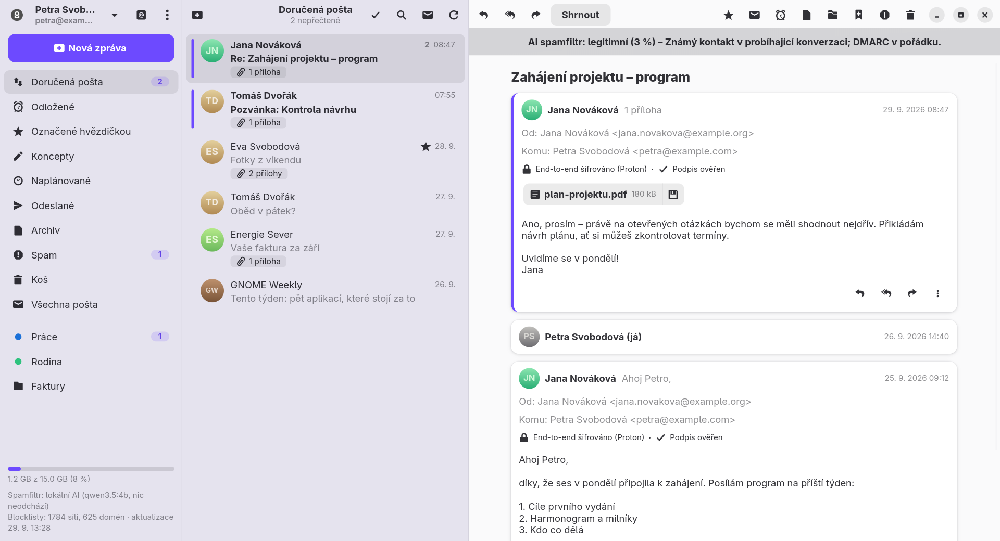
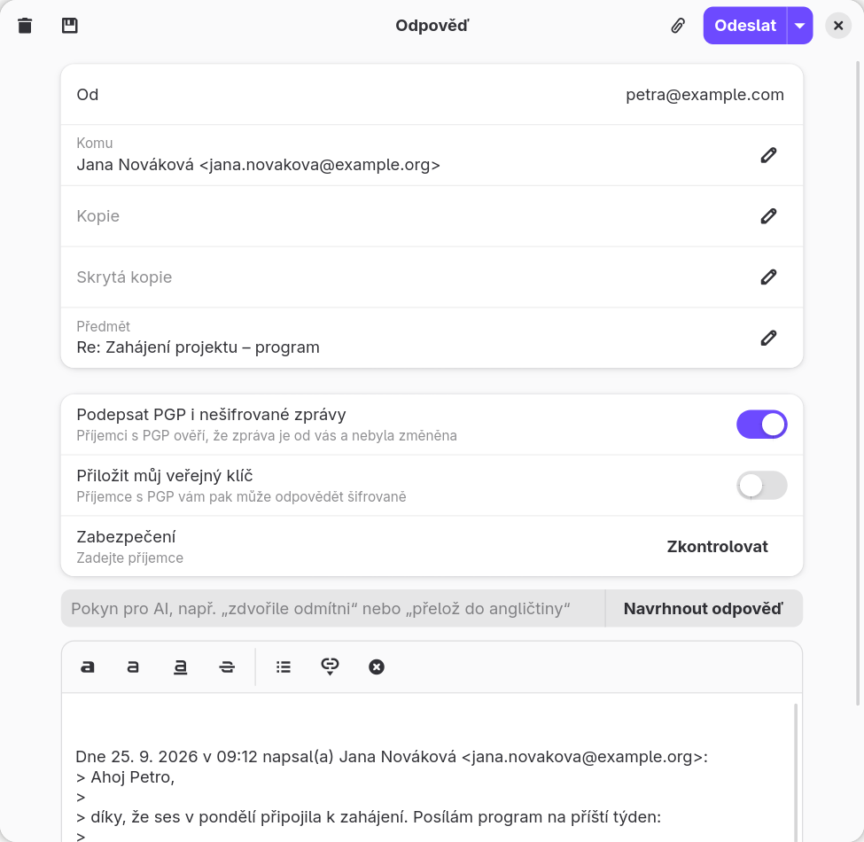
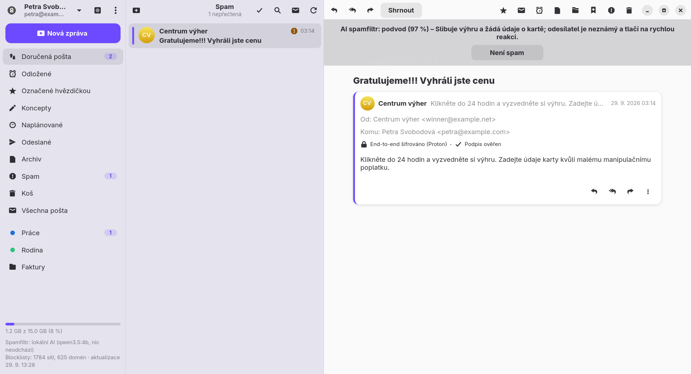
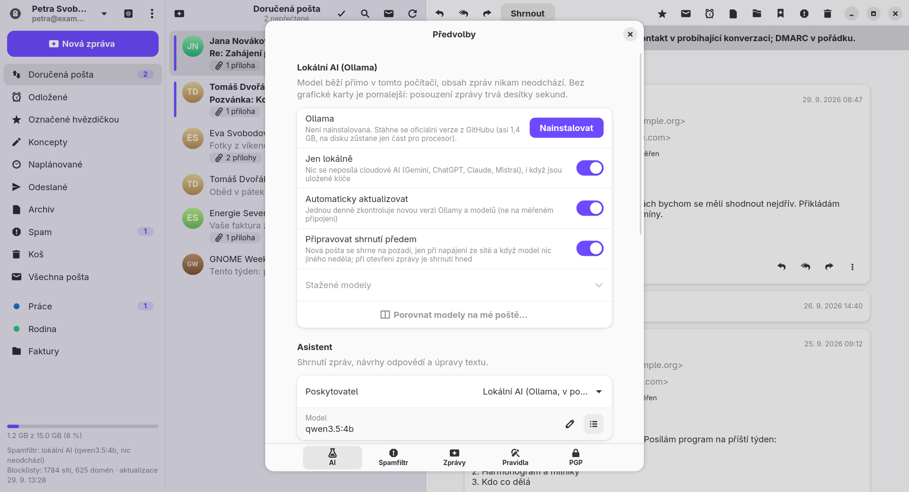
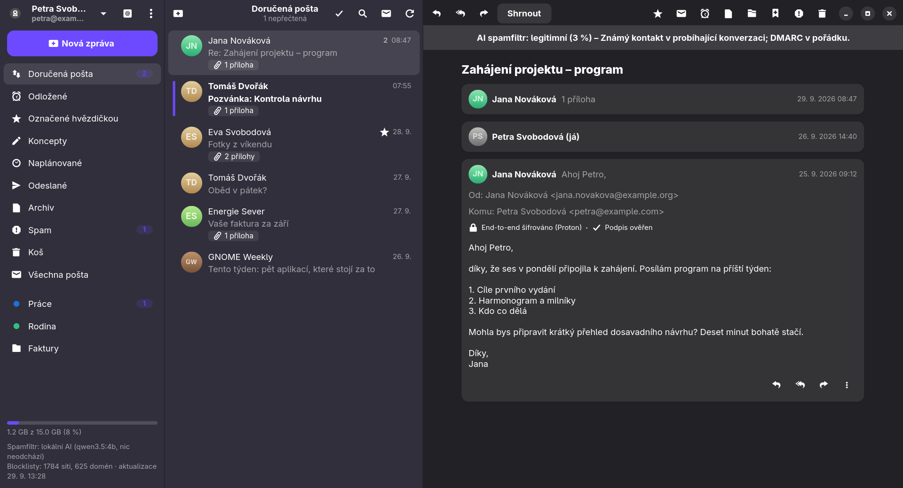

# Klient

**E-mailový klient pro GNOME s nativní podporou Proton Mailu, PGP a spamfiltrem řízeným AI.**

[English](README.md) · [Dokumentace](docs/index.cs.html) · [Vydání](https://github.com/Imbecile6197/klient/releases) · GPL-3.0



| | |
|---|---|
|  |  |
|  |  |

<sub>Snímky ukázkového režimu – všichni lidé i zprávy jsou vymyšlení. Vyzkoušet ho můžete sami: `KLIENT_DEMO=1 klient`.</sub>

Klient je napsaný v Go s GTK4 a libadwaita. Připojuje se přímo k Proton Mailu (bez Proton Bridge), ke Gmailu, k Seznam.cz a k libovolné schránce IMAP/SMTP. Každou novou zprávu nejdřív posoudí spamfiltr a teprve potom ji ukáže a ohlásí. Rozhraní je česky a anglicky.

## Funkce

- **Proton Mail nativně** – přímo přes Proton API (přihlášení SRP, dvoufázové ověření, režim dvou hesel).
- **Gmail, Seznam.cz a libovolná schránka IMAP/SMTP** – servery se dohledají samy, nová pošta přichází okamžitě přes IMAP IDLE.
- **Šifrování** – end-to-end šifrování Protonu a PGP/MIME u ostatních služeb. Klíče příjemců se hledají přes Web Key Directory, Autocrypt, importované klíče a volitelně keys.openpgp.org. Zprávy příjemcům bez klíče jde podepsat a před nešifrovaným odesláním se ukáže varování.
- **Spamfiltr s AI** – AI rozhoduje podle výsledků SPF/DKIM/DMARC, značek Protonu, zásahů v blocklistech (Spamhaus DROP, URLhaus, OpenPhish – aktualizace každých 12 hodin) a vašich seznamů povolených a blokovaných odesílatelů.
- **AI asistent** – shrnutí, návrhy odpovědí, úprava a překlad konceptu, „Zeptat se pošty“, třídění do štítků a ranní přehled. Poskytovatelé: **Claude**, **ChatGPT**, **Gemini**, **Mistral** (servery v EU) nebo **lokální model** přes spravovanou Ollamu, takže nic neopustí počítač. Režim „Jen lokálně“ zablokuje všechny cloudové poskytovatele.
- **Běžná pošta** – vlákna, bezpečné HTML zprávy s blokovaným vzdáleným obsahem, formátovaný editor, přílohy do 25 MB, koncepty, podpis, zpoždění odeslání s tlačítkem Zpět, naplánované odeslání, odkládání, pravidla, štítky a složky, přetahování, pozvánky do kalendáře, automatická odpověď (Proton), odhlášení odběru jedním kliknutím, tisk a export .eml.
- **Více účtů** v jednom okně i **všechny účty dohromady** v jednom seznamu, **Pošta k odeslání**, která neodeslanou poštu nepustí, správa složek, **běh na pozadí** s ikonou v liště, **šifrovaná offline cache**, **automatické aktualizace** z vydání na GitHubu a vestavěná **nápověda** (F1).

## Instalace

Nejnovější vydání nainstalujete přímo z GitHubu.

**Fedora** (44 a novější):

```bash
sudo dnf install https://github.com/Imbecile6197/klient/releases/latest/download/klient.x86_64.rpm
```

**Ubuntu** (26.04 LTS a novější) a další distribuce s GNOME 50:

```bash
wget https://github.com/Imbecile6197/klient/releases/latest/download/klient_amd64.deb
sudo apt install ./klient_amd64.deb
```

Debian 13 je pro Klienta příliš starý (potřebuje GLib 2.86 a libadwaita 1.6).

Potom Klient jednou denně zkontroluje nová vydání, stáhne je na pozadí, ověří kontrolní součet SHA-256 a nainstaluje je po jednom kliknutí a zadání hesla správce. Okno Co je nového ukáže změny před aktualizací i po ní.

Ikona v horní liště potřebuje v GNOME rozšíření AppIndicator (`gnome-shell-extension-appindicator`).

## Sestavení ze zdrojového kódu

```bash
sudo dnf install golang gcc gtk4-devel libadwaita-devel gobject-introspection-devel webkitgtk6.0-devel
make build        # první sestavení trvá dlouho (CGo bindingy GTK)
make run
make install      # do ~/.local včetně .desktop souboru a ikony
make rpm          # balíček pro Fedoru do build/rpm/RPMS/x86_64/
packaging/deb.sh 0.7.3   # balíček pro Ubuntu do build/deb/, sestaví se v kontejneru podman
```

Vydání nové verze (potřebuje `gh` a commitnutý strom): poznámky zapište do `packaging/release-notes/X.Y.Z.md` (oddíly „## English“ a „## Česky“ – Klient je ukáže v okně Co je nového a zveřejní se na GitHubu), pak `git tag -a vX.Y.Z -m "Klient X.Y.Z" && make release VERSION=X.Y.Z`.

## První spuštění

1. Přihlaste se účtem Proton, nebo zvolte **Jiná služba** pro Gmail, Seznam.cz či jinou schránku IMAP. Gmail a Seznam s dvoufázovým ověřením potřebují heslo pro aplikace; přihlašovací okno odkazuje na správnou stránku.
2. V **Předvolbách → AI** zvolte poskytovatele pro asistenta a pro spamfiltr a vložte jeho API klíč – nebo nainstalujte lokální AI, která poběží ve vašem počítači.
3. Volitelně spusťte z nabídky **Prověřit doručenou poštu pomocí AI** – filtr posoudí posledních 50 zpráv.

Kompletní uživatelská dokumentace je v [`docs/index.cs.html`](docs/index.cs.html) (anglicky [`docs/index.html`](docs/index.html)); v aplikaci ji otevře klávesa F1.

## Překlady

Texty v kódu jsou anglicky a překládají se přes katalogy gettext ve složce [`po/`](po/), které jsou zabudované do programu. Jazyk se řídí systémem (`LC_ALL`, `LC_MESSAGES`, `LANG`) a jde změnit v Předvolbách → Obecné. Nový jazyk přidáte zkopírováním `po/cs.po` do `po/<kód>.po`, přeložením, doplněním jazyka do `internal/i18n` (název a pravidlo pro množné číslo) a spuštěním `go test ./internal/i18n` – test ověří, že každý text v kódu má překlad se stejnými zástupnými znaky.

## Struktura

| Balíček | Účel |
|---|---|
| `internal/protonmail` | Přihlášení k Protonu, odemčení klíčů, seznam a dešifrování zpráv, přílohy, šifrované odesílání, stream událostí |
| `internal/imapmail` | Účty IMAP/SMTP: dohledání serverů, IDLE, vlákna, lokální odkládání a plánování, štítky Gmailu, PGP/MIME |
| `internal/mailbox` | Společné rozhraní účtů nad Protonem a IMAP |
| `internal/pgp`, `internal/pgpmime` | Klíče kontaktů a vlastní klíče, ověřování podpisů, PGP/MIME, WKD a Autocrypt |
| `internal/ai` | Claude, OpenAI, Gemini, Mistral a Ollama za jedním rozhraním: klasifikace spamu přes JSON schéma, shrnutí, odpovědi |
| `internal/ollama` | Spravovaná lokální Ollama: stažení, kontrolní součet, aktualizace, spouštění podle potřeby |
| `internal/spam` | Blocklisty a jejich aktualizace, spamfiltr (podklady → AI → rozhodnutí), povolení a blokovaní odesílatelé |
| `internal/i18n`, `po` | Překlady |
| `internal/update` | Aktualizace z vydání na GitHubu |
| `internal/ui` | Rozhraní pro GNOME |
| `docs` | Uživatelská dokumentace, zobrazuje se i jako Nápověda |

Soubory: nastavení v `~/.config/klient/config.json`, data (blocklisty, rozhodnutí filtru, klíče, cache, Ollama) v `~/.local/share/klient/`, tajné údaje v klíčence GNOME.

## Soukromí a omezení

- **S cloudovým poskytovatelem AI odchází obsah zpracovávaných zpráv k tomuto poskytovateli** (spamfiltr, shrnutí, návrhy). Spamfiltr posílá nejvýš prvních 6000 znaků těla. Požadavky na OpenAI používají `store: false`. S lokální AI nebo v režimu „Jen lokálně“ nic neopustí počítač.
- Proton API není pro aplikace třetích stran oficiálně dokumentované a může se změnit. Proton může přihlášení odmítnout nebo vyžádat CAPTCHA; obvykle pomůže jednou se přihlásit přes web ze stejné sítě. Aplikace se identifikuje hlavičkou `x-pm-appversion` (`proton_app_version` v nastavení, výchozí `Other`).
- U Protonu hledání prochází předmět, odesílatele a příjemce, ne text zprávy (těla jsou na serveru šifrovaná end-to-end).
- U služeb IMAP fungují odkládání a naplánované odeslání, jen když Klient běží (stačí na pozadí).
- Outlook / Hotmail není podporovaný.
- `third_party/go-proton-api` je kopie knihovny Protonu s několika doplňky (pole konverzací, naplánované odeslání, odkládání, automatická odpověď); `third_party/gotk4-webkitgtk` je výběr Go bindingů WebKitGTK. Podrobnosti jsou v `KLIENT_PATCHES.md` v obou složkách.

## Licence

Chyby a nápady pište do [Issues](https://github.com/Imbecile6197/klient/issues).

Licence [GNU General Public License v3.0](LICENSE).
